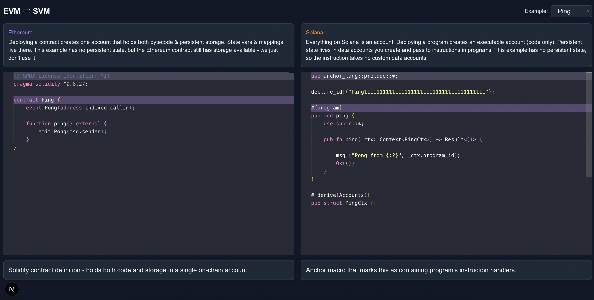

# Solana vs Ethereum

A demo of some simple Solana programs and Ethereum smart contracts, written in Rust and Solidity respectively. You can explore the contracts in the [examples](examples) directory or run the frontend to see line-by-line comparisons and compare how it is to deploy and interact with them.

<div align="center"> 
  
</div>

<details>
  <summary>Client</summary>
  <ul>
    <li><a href="https://www.typescriptlang.org/">Typescript</a></li>
    <li><a href="https://nextjs.org/">Next.js</a></li>
    <li><a href="https://reactjs.org/">React.js</a></li>
    <li><a href="https://tailwindcss.com/">TailwindCSS</a></li>
  </ul>
</details>

<details>
  <summary>Server</summary>
  <ul>
    <li><a href="https://www.typescriptlang.org/">Typescript</a></li>
    <li><a href="https://expressjs.com/">Express.js</a></li>
    <li><a href="https://go.dev/">Golang</a></li>
    <li><a href="https://nestjs.com/">Nest.js</a></li>
    <li><a href="https://socket.io/">SocketIO</a></li>
    <li><a href="https://www.prisma.io/">Prisma</a></li>    
    <li><a href="https://www.apollographql.com/">Apollo</a></li>
    <li><a href="https://graphql.org/">GraphQL</a></li>
  </ul>
</details>

<details>
<summary>Database</summary>
  <ul>
    <li><a href="https://www.mysql.com/">MySQL</a></li>
    <li><a href="https://www.postgresql.org/">PostgreSQL</a></li>
    <li><a href="https://redis.io/">Redis</a></li>
    <li><a href="https://neo4j.com/">Neo4j</a></li>
    <li><a href="https://www.mongodb.com/">MongoDB</a></li>
  </ul>
</details>

<details>
<summary>DevOps</summary>
  <ul>
    <li><a href="https://www.docker.com/">Docker</a></li>
    <li><a href="https://www.jenkins.io/">Jenkins</a></li>
    <li><a href="https://circleci.com/">CircleCLI</a></li>
  </ul>
</details>

<!-- Features -->
### :dart: Features

- Compare Ethereum and Solana contracts/programs side by side, with detailed explanations on each line when hovered
- Deploy to devnets
- Interact with the functions and compare metrics 

<!-- Env Variables -->
### :key: Environment Variables

To run this project, you will need to add the following environment variables to your .env file

`API_KEY`

`ANOTHER_API_KEY`

<!-- Getting Started -->
## 	:toolbox: Getting Started

This is a complex project as it compiles and deploys Solana (Anchor) and Ethereum (Foundry) projects, as well as a frontend. You don't need all these tools - it is intended to be able to run locally without installing Solana and Ethereum toolkits, as the artifacts are copied over into the `frontend` directory. You will only need to install the frontend packages with your desired package manager to run it locally, and you'll need to install Anchor or Forge if you wish to contribute more examples.

<!-- Prerequisites -->
### :bangbang: Prerequisites

- Your preferred package manager
```bash
 npm install --global bun
```
If you wish to add your own Solana example

- Rust
```bash
curl --proto '=https' --tlsv1.2 -sSf https://sh.rustup.rs | sh -s -- -y
```

- Solana CLI
```bash
sh -c "$(curl -sSfL https://release.anza.xyz/stable/install)"
```

- Anchor CLI
```bash
cargo install --git https://github.com/coral-xyz/anchor avm --force
```

If you wish to add your own Ethereum example

- Forge
```bash
curl -L https://foundry.paradigm.xyz | bash
```

<!-- Installation -->
### :gear: Run locally

Clone this repo and install packages with your preferred package manager
```bash
cd sol-vs eth
bun install
```
Start the server
```bash
bun dev
```

<!-- Usage -->
## :eyes: Usage

Hover over lines in the Ethereum and Solana code to learn more about what is happening under the hood.


Interact directly from your browser. See the differences in fees and time


## :handshake: Contact

Find me on X - [@catmcgeecode](https://twitter.com/catmcgeecode) 